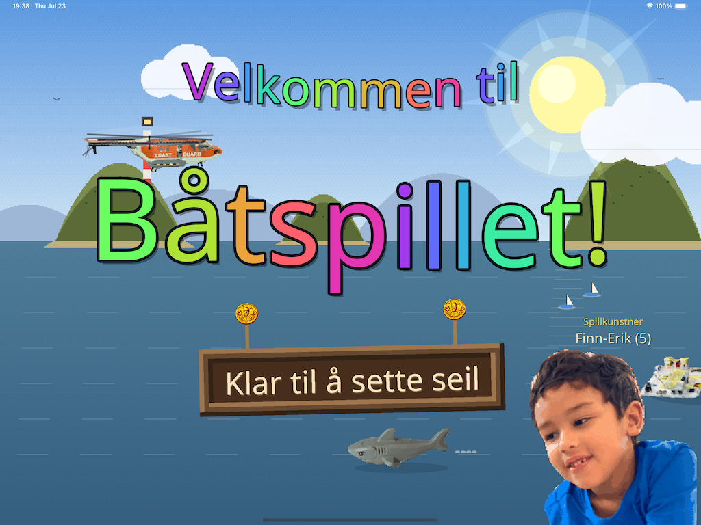

# Båtspillet 🚤



Et båtspill jeg har laget til gutten min, Finn-Erik (5). Du seiler mellom byer,
frakter passasjerer og fisk, finner skatter — og passer deg for sjørøvere.
På App Store til iPhone, iPad og Mac. Koden ligger her.

Klikk på vannet, eller styr med piltastene. Seil bort til en havn, så legger
båten til av seg selv, og pilen over båten viser veien videre.

## Utvikle

```sh
./bygg.sh setup     # én gang: bygger spillmotoren
love .              # spill det du nettopp endret
```

Alt ligger i `src/`:

| Mappe | Hva |
|-------|-----|
| `config.lua` | **alle tall og farger — vil du endre følelsen, gjør det her** |
| `data/` | byer, båter, skip, butikk … selve innholdet, trygt å endre |
| `scenes/` | meny, båtvalg, kartvalg, og `world.lua` som er selve spillet |
| `entities/` | båt, havn, sjørøver, hai, delfiner |
| `systems/` | terreng, skatter, kamera, kjøp i app |
| `ui/` | HUD, hyllen, havneskjermen, minikartet, albumet |

**F5** laster scenen på nytt, **F6** laster `src/data/*` på nytt — uten å starte
spillet. Tester kjører uten LÖVE: `luajit tests/save_state.lua` (flere i `tests/`).

Detaljene — og *hvorfor* ting er som de er — står i `CLAUDE.md`.

## Slippe en ny versjon

```sh
./bygg.sh           # meny → 1. Slipp ny versjon
```

Den bygger **både iOS (iPhone + iPad) og macOS** med samme versjonsnummer,
sjekker signering før den begynner, og åpner Transporter med begge til slutt.
Så, i App Store Connect: lag den versjonen for **begge** plattformene, velg
byggene, send til vurdering. Menyen skriver ut framgangsmåten til slutt, så du
slipper å huske den. Skjermbilder: **meny → 5**.

## Lisens

Koden og våre egne assets er **MIT** (`LICENSE`) — bruk dem gjerne! Noen sprites
er fra [OpenGFX](https://github.com/OpenTTD/OpenGFX), brukt med tillatelse.
Stemmeklipp og portretter er opptak av familien vår og er **ikke** til gjenbruk;
spillet lager syntetiske erstatninger hvis du sletter dem.
